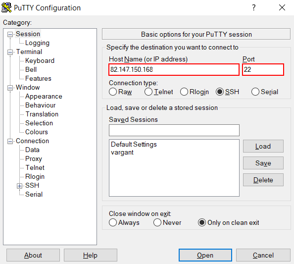
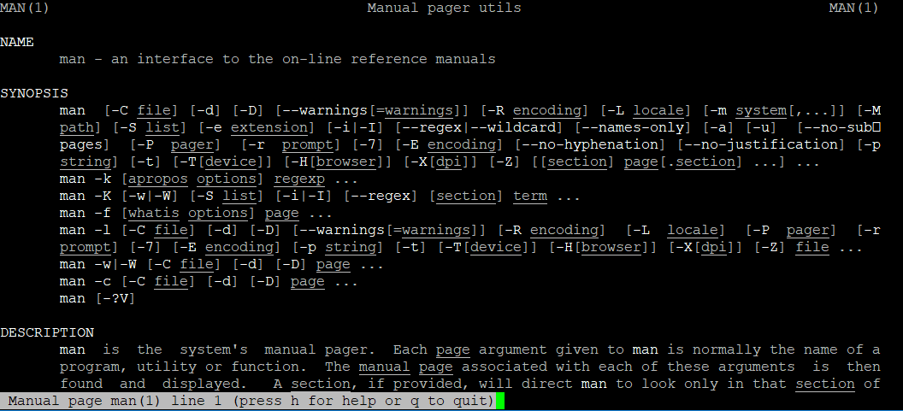

# Linux

## Въведение
**Системното програмиране** е дисциплина, която се занимава с разработката на **системен софтуер**. Характерно за системния софтуер е, че обикновено той взаимодейства пряко с хардуера и системните библиотеки на ядрото на операционната система (ОС) и служи за платформа на други приложения, които в повечето случаи се използват от крайния потребител (приложен софтуер).

## Работна среда
Работната среда се състои от един Линукс сървър с реален Интернет протокол адрес **82.147.150.168** и множество Windows клиенти. Достъпа на клиентите до сървъра се осъществява посредством [Telnet](https://en.wikipedia.org/wiki/Telnet)  използвайки [SSH](https://bg.wikipedia.org/wiki/SSH ).
 
Telnet е разработен през 1969 г., като се започне с [RFC 15](https://tools.ietf.org/html/rfc15), разширен в [RFC 854](https://tools.ietf.org/html/rfc854) и стандартизиран като интернет стандарт [STD 8](https://en.wikipedia.org/wiki/STD_8)  на  [Internet Engineering Task Force](https://en.wikipedia.org/wiki/Internet_Engineering_Task_Force), един от първите интернет стандарти. Telnet осигурява достъп до интерфейс на командния ред на отдалечен хост до мрежови устройства и/или операционни системи. Поради сериозните опасения за сигурността при използването на Telnet през отворена мрежа като Интернет, използването му за тази цел значително намаля в полза на SSH.

SSH използва криптография с публичен ключ, за да удостовери отдалечения компютър и да му позволи да удостовери потребителя, ако е необходимо. Протоколът обикновено се използва за влизане в отдалечена машина и изпълнение на команди. Той може да прехвърля файлове, като използва свързаните протоколи за прехвърляне на файлове (SFTP) или защитени копия (SCP).
 
Системният софтуер включва шелл (shell), текстов редактор (text editor), компилатор (compiler) и дебъгер (debugger), инструменти (tools) и демони (daemons) на операционната система. Тези компоненти са изцяло системен софтуер, базиран на ядрото и библиотеката C.

## Oтдалечен достъп
За осъществяване на отдалечен достъп до сървъра се изполва програмата **PuTTY**, която се разпространява като софтуер с отворен код и може да бъде изтеглена безплатно от Интернет на адрес: https://putty.org/ 
  
 

## Как да получите помощ в Линукс?
Повечето системни приложения и команди, работещи в конзолен режим на операционната система Линукс, имат съпътстваща документация във формата на страници от ръководства - **manual pages**. За достъп до тях можете да използвате програмата **man**, със следния формат:
```
man <команда>
```
където *<команда>* е името на приложението, за което искате да получите информация.
Ако съществува ръководство за избраната команда, man ще отпечата първата страница на екрана и ще предостави на потребителя средства за навигация в останалата част. Подробно описание на функциите, съответно можете да видите със следната команда:
```
man man
```
  
По-важните клавиши, които можете да изполвате при работа в програмата са **PgUp** за прелистване на страница нагоре, **PgDn** за прелистване на страница надолу и клавиша **q** за изход.

## Файлове, директории и файлови системи
**Файловете** са базово понятие във всички популярни операционни системи. Това напълно се отнася и за ОС Линукс, която се характеризира с това, че в нея “всичко е файл” (“everything is a file”). Файловете се групират в **директории**, които от своя страна могат да съдържат други под-директории и по този начин се създава дървовидна структура.

[Файловата система](https://github.com/fosscourse/wiki/wiki/Файлова_система_в_Линукс_-_структура_и_основни_понятия) е начина за структуриране и организация на данните в компютъра. Тя представлява служебна таблица записана на диска, която операционната система използва, за да получи достъп до файловете. Записите в таблицата се наричат **inode** и накратко могат да се определят като сериен номер на файла.

Основни команди за работа с файловата система под Линукс са представени в таблицата по-долу:

| Команда | Описание                                             |
| ------- | ---------------------------------------------------- |
| pwd     | Отпечава името на текущата директория                |
| ls      | Списък на съдържанието на директорията               |
| mkdir   | Създава директория                                   |
| cd      | Смяна на работната директория                        |
| rmdir   | Изтриване на директория                              |
| cp      | Копиране на файлове и директории                     |
| mv      | Преместване и/или преименуване на файлове            |
| rm      | Изтриване на файлове и/или директории                |
| ln      | Създава връзка между файлове                         |
| cat     | Конкатенира файлове и отпечатва на стандартния изход |
 
## Потребители и групи
За да получи достъп до функциите на Линукс, всеки потребител трябва да премине през процес на идентификация (**login**), където се въвежда потребителско име и парола. След въвеждане на правилна комбинация, потребителят се регистрира в операционната система и се асоциира с уникален идентификатор наречен **`uid`**, който представлява цяло положително число. Тъй като имената също трябва да са уникални, в практиката те се използват по-често от **`uid`** за идентифициране на потребителите.

От своя страна, всеки потребител принадлежи към една или повече потребителски групи. По този начин едни и същи атрибути или права могат да се задават едновременно на множество потребители, в зависимост от тяхната роля в системата.

Авторизацията за достъп до ресурсите в Линукс се осигурява, чрез тази концепция за потребители и групи. Например, операциите, които може да извършвате с файловете в ОС, зависят от правата, които притежава Вашият потребител и групата, към която принадлежи.

## Файлови права
Традиционните файлови системи поддържат три **режима** за използване на файловете: четене (***read***), запис (***write***) или изпълнение (***execute***). 

От друга страна, всеки файл в Линукс принадлежи на **потребител** и **група**, като по подразбиране, това са създателя на файла и първичната му група. На базата на това са дефинирани три **нива** на правата за достъп до файлови операции: за собственика (***owner***), за групата (***group***) и общо (***public***).

Чрез комбинирането на трите нива и трите режима се получават 9 възможни характеристики на файловете, които могат да се представят със следната битова маска (първият флаг показва дали полето описва директория или файл):


На горния пример, притежателят на файла има пълни права над файла, членовете на групата на файла имат права за четене и изпълнение, а всички останали потребители имат само право за четене.

В конзолен режим на Линукс може да разгледаме правата на елементите в текущата директория с помощта на командата:
```
ls -la
```
  

В Линукс има дефинирани допълнителни специални режими за файловете и директориите. Един от тези режими е **SUID** (“Set-user Identification”) и в маската за правата се идентифицира със `(s)` вместо `(x)` на ниво собственик. Когато файл с изпълним код е в този режим и бъде изпълнен, то създадените процеси и ресурси ще принадлежат на собственика на файла, а не на потребителя, стартирал приложението.

Друг специален режим е **SGID** (“Set-group Identification”) и се идентифицира със `(s)` вместо `(x)` на ниво група. Когато файл с изпълним код е в този режим и бъде изпълнен, то създадените процеси и ресурси ще принадлежат на групата на собственика на файла, а не на потребителя, стартирал приложението. Когато директория е в режим **SGID**, то създадените в нея файлове по подразбиране ще принадлежат на групата на горната директория.

Режимът **Sticky bit**, който се идентифицира със `(s)` вместо `(x)` на общо ниво, често се използва за споделени директории. Когато директория е в този режим, потребителите имат право да четат и изпълняват файлове на други потребители, но не могат да ги изтриват или преименуват.

## Управление на потребители и групи
В таблицата по-долу са дадени команди от операционната система, които се използват за управление на потребители и групи:

| Команда | Пояснение                                                           |
| ------- | ------------------------------------------------------------------- |
| id      | отпечатва реални и ефективни потребителски и групови идентификатори |
| chmod   | промяна на бита на файловия режим                                   |
| umask	  | задаване на маска за създаване на файлов режим                      |
| chown	  | промяна на собственика на файла и групата                           |
| chgrp   | промяна на собствеността на групата                                 |
| passwd  | промяна на потребителската парола                                   

## Пренасочване на потоци
Линукс поддържа различни средства за работа с входно-изходните потоци, например:

- Операторът “по-голямо” **`>`** пренасочва изхода на програмите към файл, вместо да бъдат отпечатани на екрана. Ако файлът вече съществува, съдържанието му ще бъде изтрито и версия с новото съдържание ще бъде запазена.
- Операторът “двойно по-голямо” **`>>`** пренасочва изхода и го добавя към файл, ако вече съществува.
- Операторът “конвейер” **`|`** пренасочва изхода на програмата отляво като вход на програмата отдясно.

## Текстовият редактор Nano

Текстовите файлове са често използвано средство за съхранение и обмен на информация в Линукс. Поради това, почти всяка една дистрибуция предлага средства за работа с тях. В нашата работна среда ще използваме текстовия редактор **Nano**:

  

Някои от основните функции на **Nano** са:
### Файлов контрол

| Клавиш          | Пояснение                            |
| --------------- | ------------------------------------ |
| nano readme.txt | Отваря или съдава файл readme.txt    |
| Ctrl-o Y Enter  | Запазва промените                    |
| Ctrl-r Alt-f    | Отваря нов файл                      |
| Alt->           | Превключва към следващ отворен файл  |
| Alt-<           | Превключва към предишен отворен файл |
| Ctrl-x          | Изход от редактора                   |

### Навигация в съдържанието

| Клавиш | Пояснение                             |
| ------ | ------------------------------------- |
| Ctrl-a | Преместване в началото на текущия ред |
| Ctrl-e | Преместване в края на текущия ред     |
| Ctrl-v | Прелистване страница надолу           |
| Ctrl-y | Прелистване страница нагоре           |
| Alt-\  | Позициониране в началото на файла     |
| Alt-/  | Позициониране в края на файла         |
| Alt-g  | Позиционира към желан ред от файла    |

### Копиране и вмъкване

| Клавиш       | Пояснение                                                      |
| ------------ | -------------------------------------------------------------- |
| Alt-a	       | Избор на блок за копиране или вмъзкване                        |
| Alt-a Alt-^  | Копиране (Copy) на избрания блок в клипборда                   |
| Alt-a Ctrl-k | Изрязване(Cut) на избрания блок в клипборда                    |
| Ctrl-k       | Изрязване(Cut) от позицията на курсора до края на реда         |
| Ctrl-u       | Вмъкване (Paste) съдържанието от клипборда на текущата позиция |

### Търсене и заместване

| Клавиш | Пояснение                  |
| ------ | -------------------------- |
| Ctrl-w | Търсене на текст           |
| Alt-w  | Повтаря последното търсене |
| Alt-r  | Търсене и заместване       |
 
Полезна информация:
- [The Beginner’s Guide to Nano, the Linux Command-Line Text Editor](https://www.howtogeek.com/howto/42980/the-beginners-guide-to-nano-the-linux-command-line-text-editor/)
- [Nano text editor command cheatsheet](http://www.codexpedia.com/text-editor/nano-text-editor-command-cheatsheet/)

# Webminal
http://webminal.org/
